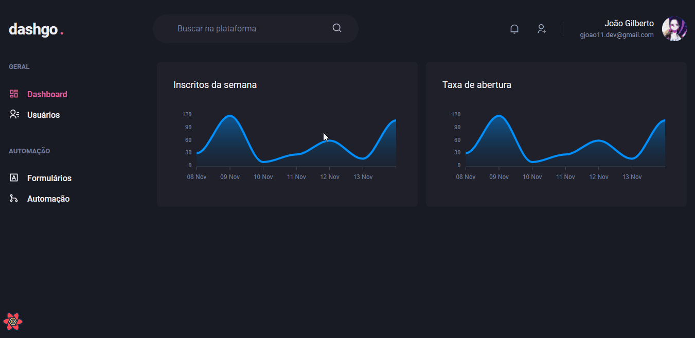

# Sobre
Projeto construído durante o Ignte ReactJS a fim de estudar: 
- Construção de interface utilizando Chakra UI;
- Formulários e validação com React Hook Form e Yup;
- Cache local com React Query.

# Tecnologias

- [React](https://reactjs.org/)
- [Next.js](https://nextjs.org/)
- [Chakra UI](https://chakra-ui.com/)
- [React Hook Form](https://react-hook-form.com/)
- [Yup](https://github.com/jquense/yup)
- [React Query](https://react-query.tanstack.com/)

# Instalação

```bash
  # Clone o repositório
  $ https://github.com/gjoao11/dashgo.git

  # Acesse o diretório do app
  $ cd dashgo

  # Instale as dependências
  $ yarn

  #Inicie a aplicação
  $ yarn dev

  # acesse `http://localhost:3000/dashboard`
```
